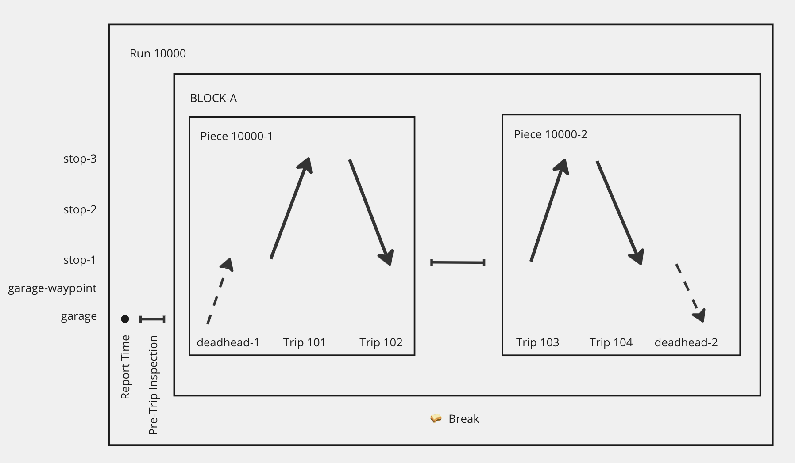
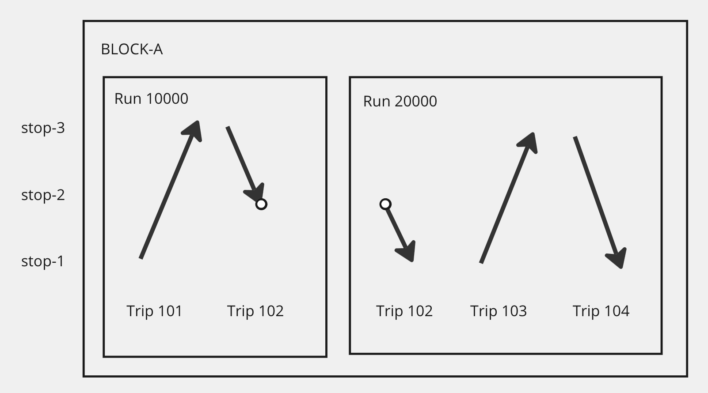

# Examples

The following sections provide examples of how TODS can represent specific use cases. The inclusion of these examples should not
be as an indication that this is the only way to represent these use cases with TODS. If you have questions about a use case not
represented here, please feel free to [create an issue in GitHub](https://github.com/cal-itp/operational-data-standard/issues/new).

## Single Run with Pull-Out and Lunch Break

In this example, a bus driver is assigned to run 10000, which has four revenue trips on two pieces, all on the same block. The run also includes a pull-out, a pull-back, a pre-trip inspection, and a lunch break between the two pieces.



### GTFS Files

These are the same files that would be published in the agency's public GTFS file, and contains only revenue trips and public information.

Some irrelevant files are ommitted for brevity.

#### `stops.txt`

```csv
stop_id,location_type
stop-1,0
stop-2,0
stop-3,0
```

#### `routes.txt`

```csv
route_id,route_short_name,route_type
12,12,3
```

#### `trips.txt`

```csv
route_id,service_id,trip_id,trip_headsign,direction_id,block_id
12,daily,101,North,0,BLOCK-A
12,daily,102,South,1,BLOCK-A
12,daily,103,North,0,BLOCK-A
12,daily,104,South,1,BLOCK-A
```

#### `stop_times.txt`

```csv
trip_id,arrival_time,stop_id,stop_sequence
101,10:00,stop-1,1
101,10:25,stop-2,2
101,10:50,stop-3,3
102,11:00,stop-3,1
102,11:25,stop-2,2
102,11:50,stop-1,3
103,13:00,stop-1,1
103,13:25,stop-2,2
103,13:50,stop-3,3
104,14:00,stop-3,1
104,14:25,stop-2,2
104,14:50,stop-1,3
```

### TODS Files

These are the new files that are published in TODS. In this example, the TODS files do not delete or modify any rows that were published in GTFS.

#### `stops_supplement.txt`

```csv
stop_id,location_type,TODS_location_type
garage,0,garage
garage-waypoint,0,
```

#### `routes_supplement.txt`

```csv
route_id,route_long_name
deadheads,Deadheads
```

In this example, the agency puts all of its deadheads on this new route, though agencies may have other ways to assign deadheads to routes.

#### `trips_supplement.txt`

```csv
route_id,service_id,trip_id,block_id,TODS_trip_type
deadheads,daily,deadhead-1,BLOCK-A,pull-out
deadheads,daily,deadhead-2,BLOCK-A,pull-back
```

In this example, consumers know that these trips aren't in revenue service because of the `route_id` and `TODS_trip_type`.

#### `stop_times_supplement.txt`

```csv
trip_id,arrival_time,stop_id,stop_sequence
deadhead-1,09:45:00,garage,1
deadhead-1,09:50:00,garage-waypoint,2
deadhead-1,09:55:00,stop-1,3
deadhead-2,14:50:00,stop-1,1
deadhead-2,14:55:00,garage-waypoint,2
deadhead-2,15:00:00,garage,3
```

#### `run_events.txt`

```csv
service_id,run_id,event_sequence,piece_id,block_id,job_type,event_type,trip_id,start_location,start_time,start_mid_trip,end_location,end_time,end_mid_trip
daily,10000,10,       ,       ,Operator,Report Time,        ,garage,09:30:00,,garage,09:30:00,
daily,10000,20,       ,       ,Operator,Pre-Trip Inspection,,garage,09:35:00,,garage,09:45:00,
daily,10000,30,10000-1,BLOCK-A,Operator,Pull-Out,deadhead-1 ,garage,09:45:00,2,stop-1,09:55:00,2
daily,10000,40,10000-1,BLOCK-A,Operator,Operator,101        ,stop-1,10:00:00,2,stop-3,10:50:00,2
daily,10000,50,10000-1,BLOCK-A,Operator,Operator,102        ,stop-3,11:00:00,2,stop-1,11:50:00,2
daily,10000,60,       ,       ,Operator,Break,              ,stop-1,11:50:00,,stop-1,13:00:00,
daily,10000,70,10000-2,BLOCK-A,Operator,Operator,103        ,stop-1,13:00:00,2,stop-3,13:50:00,2
daily,10000,80,10000-2,BLOCK-A,Operator,Operator,104        ,stop-3,14:00:00,2,stop-1,14:50:00,2
daily,10000,90,10000-2,BLOCK-A,Operator,Pull-Back,deadhead-2,stop-1,14:50:00,2,garage,15:00:00,2
```

## Multiple Runs on a Single Block with Mid-Trip Relief

In this example, the bus driver assigned to run 10000 pulls out a bus, does trip 101 and part of trip 102, and then ends their day at `stop-2`. A new driver on run 20000 boards the bus, completes trip 102, then does trip 103 and trip 104, and pulls back to the garage.



This example uses the [exact same GTFS files as the previous example](#gtfs-files). Deadheads and nonrevenue locations are omitted in order to focus on the revenue trip assignments, so no `_supplement.txt` files are needed for this example. Only `run_events.txt` needs to change to reflect the multiple runs and mid-trip relief.

### `run_events.txt`

```csv
service_id,run_id,event_sequence,piece_id,block_id,job_type,event_type,trip_id,start_location,start_time,start_mid_trip,end_location,end_time,end_mid_trip
daily,10000,10,10000-1,BLOCK-A,Operator,Operator,101,stop-1,10:00:00,2,stop-3,10:50:00,2
daily,10000,20,10000-1,BLOCK-A,Operator,Operator,102,stop-3,11:00:00,2,stop-2,11:25:00,1
daily,20000,10,20000-1,BLOCK-A,Operator,Operator,102,stop-2,11:25:00,1,stop-1,11:50:00,2
daily,20000,20,20000-1,BLOCK-A,Operator,Operator,103,stop-1,13:00:00,2,stop-3,13:50:00,2
daily,20000,30,20000-1,BLOCK-A,Operator,Operator,104,stop-3,14:00:00,2,stop-1,14:50:00,2
```

## Multiple operators on the same trip

In this example (unrelated to the previous examples), a two-car train does a round trip, and requires two operators, one in the first car and one in the second car. The `event_type` field distinguishes whether an operator is in the front car or the rear car. The operators swap for the return trip.

### `run_events.txt`

```csv
service_id,run_id,event_sequence,job_type,event_type,trip_id,start_location,start_time,end_location,end_time
weekday,10000,10,Operator,Operate 1st Car,trip-1,stop-1,10:00:00,stop-2,10:58:00
weekday,10000,20,Operator,Operate 2nd Car,trip-2,stop-2,11:00:00,stop-1,11:58:00
weekday,20000,10,Operator,Operate 2nd Car,trip-1,stop-1,10:00:00,stop-2,10:58:00
weekday,20000,20,Operator,Operate 1st Car,trip-2,stop-2,11:00:00,stop-1,11:58:00
```

## Run as Directed work

In this example (unrelated to the previous examples), an operator signs in for their shift, pulls out, and then operates a bus for several hours. They are not scheduled to do specific trips, but instead do trips as directed to by dispatch. This approach could apply in several situations:

- An agency uses `frequencies.txt` (`frequencies.trip_id` may be able to be referenced in `run_events.trip_id`).
- An agency publishes specific times in GTFS `trips.txt`, but in practice operates the service according to a headway, or doesn't schedule operators to specific trips.
- The operator is assigned to cover or strategic work, and is positioned somewhere where they can cover absences or gaps in service on any route throughout the day.

### `run_events.txt`

```csv
service_id,run_id,event_sequence,block_id,event_type,trip_id,start_location,start_time,end_location,end_time
weekday,10000,10,       ,sign-in        ,,garage,08:45:00,garage,08:50:00
weekday,10000,20,BLOCK-A,deadhead       ,,garage,08:50:00,stop-1,09:00:00
weekday,10000,30,BLOCK-A,run-as-directed,,stop-1,09:00:00,stop-1,12:00:00
weekday,10000,30,BLOCK-A,deadhead       ,,stop-1,12:00:00,garage,12:10:00
```

## Vehicle Assignments

Vehicles are assigned by service date. In this example, vehicle assignments are provided for 3 consecutive days from February 5 through 7.

### `vehicles.txt`

```csv
vehicle_id,vehicle_label,license_plate
bus-1,Old Reliable,OR-E285104
bus-2,Buster,OR-E251432
```

### `vehicle_assignments.txt`

```csv
date,service_id,block_id,vehicle_id
20250205,daily,BLOCK-A,bus-1
20250206,daily,BLOCK-A,bus-2
20250207,daily,BLOCK-A,bus-1
```

## Employee Assignments

This example uses [`employee_run_dates.txt`](index.md#employee_run_datestxt) to assign employees to runs (and trips).

In this example, `A` and `B` work Monday-Wednesday and Sunday. `C` and `D` work Thursday-Saturday.

On Wedneday, July 3, `A` has scheduled vacation, so a substitute is assigned instead.

**[`calendar.txt`](https://gtfs.org/documentation/schedule/reference/#calendartxt)**

```csv
service_id,monday,tuesday,wednesday,thursday,friday,saturday,sunday,start_date,end_date
weekday,1,1,1,1,1,0,0,20240701,20240707
weekend,0,0,0,0,0,1,1,20240701,20240707
```

July 1, 2024 was a Monday.

**[`run_events.txt`](index.md#run_eventstxt)**

For this example, the purpose of this file is just to show which runs exist. Real runs would have more interesting data.

```csv
service_id,run_id,event_sequence,event_type,trip_id,start_location,start_time,end_location,end_time
weekday,101,1,work,trip1,station,09:00:00,station,17:00:00
weekday,102,1,work,trip2,station,09:00:00,station,17:00:00
weekend,103,1,work,trip3,station,09:00:00,station,17:00:00
weekend,104,1,work,trip4,station,09:00:00,station,17:00:00
```

**[`employee_run_dates.txt`](index.md#employee_run_datestxt)**

```csv
date,service_id,run_id,employee_id
20240701,weekday,101,A
20240701,weekday,102,B
20240702,weekday,101,A
20240702,weekday,102,B
20240703,weekday,101,A
20240703,weekday,102,B
20240704,weekday,101,C
20240704,weekday,102,D
20240705,weekday,101,C
20240705,weekday,102,D
20240706,weekend,103,C
20240706,weekend,104,D
20240707,weekend,103,A
20240707,weekend,104,B
```
