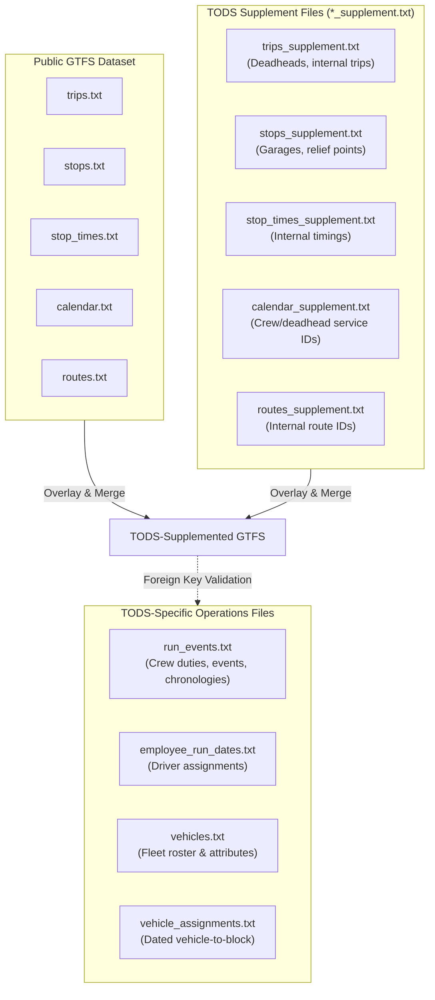

# Transit Operational Data Standard (TODS v2.1.0) Guide

The **Transit Operational Data Standard (TODS)** is an open specification maintained by [MobilityData](https://tods.mobilitydata.org) for describing internal scheduled transit operations. While public **GTFS** represents passenger-facing service, TODS captures the back-office operational reality required by drivers, dispatchers, CAD/AVL, and scheduling systems (e.g., Hastus, Trapeze).

TODS standardizes:
1. **Crew Runs & Events:** Pieces of work, report/clear times, sign-in/out, reliefs, and meal breaks.
2. **Operational Trips & Deadheads:** Garage pull-outs, pull-ins, repositioning moves, and training trips.
3. **Internal Stops & Waypoints:** Garages, depots, staging yards, relief points, and timing checkpoints.
4. **Fleet & Vehicle Blocks:** Vehicle rosters and dated vehicle-to-block assignments.

---

## 1. Architecture: Base GTFS + Supplements + TODS-Specific

A complete TODS dataset builds on top of standard GTFS via two complementary mechanisms:



---

## 2. Supplement Evaluation Algorithm

Supplement files match the field definitions of their base GTFS counterpart with specific TODS operational fields added (such as `TODS_delete`, `TODS_trip_type`, `TODS_location_type`).

### Primary Keys for Supplement Files

| File | Primary Key Columns |
| :--- | :--- |
| `trips_supplement.txt` | `trip_id` |
| `stops_supplement.txt` | `stop_id` |
| `stop_times_supplement.txt` | `trip_id`, `stop_sequence` |
| `routes_supplement.txt` | `route_id` |
| `calendar_supplement.txt` | `service_id` |
| `calendar_dates_supplement.txt` | `service_id`, `date` |

### Evaluation Rules

When applying a supplement file to its corresponding base GTFS file:

1. **Delete Operation:**
   - If the row's Primary Key exists in the base GTFS file **and** `TODS_delete == '1'`, the corresponding row is **removed** from the dataset. All other columns in the supplement row are ignored.
2. **Patch/Update Operation:**
   - If the row's Primary Key exists in the base GTFS file **and** `TODS_delete` is empty (or not `'1'`), any **non-blank values** in the supplement row overwrite the corresponding GTFS values.
   - Blank/omitted columns in the supplement file do **not** clear existing GTFS data.
3. **Insert Operation:**
   - If the row's Primary Key does **not** exist in the base GTFS file, the entire row is **added** as a new record. (The new row must fulfill GTFS required fields for that table).

### Supplement Merge Example

**GTFS `stops.txt`**:
```csv
stop_id,stop_name,stop_desc,stop_url
1,One,Unmodified in TODS,example.com/1
2,Two,Deleted in TODS,example.com/2
3,Three,Will be modified in TODS,example.com/3
```

**TODS `stops_supplement.txt`**:
```csv
stop_id,stop_name,stop_desc,TODS_delete
2,,,1
3,,Has been modified by TODS,
4,Four,New in TODS,
```

**Effective Result**:
```csv
stop_id,stop_name,stop_desc,stop_url
1,One,Unmodified in TODS,example.com/1
3,Three,Has been modified by TODS,example.com/3
4,Four,New in TODS,
```

---

## 3. TODS-Specific Files Reference

### `run_events.txt`
Defines the chronological sequence of scheduled duties and events performed by personnel during a run.
- **Primary Key:** `(service_id, run_id, event_sequence)`

| Field Name | Type | Required | Description |
| :--- | :--- | :---: | :--- |
| `service_id` | ID | Yes | Calendar service ID when this run operates. |
| `run_id` | ID | Yes | Run identifier (e.g. `Run101`, `R-404`). Unique per `service_id`. |
| `event_sequence` | Integer | Yes | Chronological ordering of events within the run. |
| `piece_id` | ID | No | Identifies the piece of work (e.g., split shift halves). |
| `block_id` | ID | No | Vehicle block ID worked during this event. Must match `trips.txt:block_id` if set. |
| `job_type` | Text | No | Human-readable role (e.g., `"Bus Operator"`, `"Shifter"`, `"Relief Conductor"`). |
| `event_type` | Text | Yes | Operational event type (e.g. `report`, `clear`, `trip`, `deadhead`, `relief`, `break`, `travel`). |
| `trip_id` | ID | No | Trip worked during this event. References supplemented `trips.txt`. |
| `start_location` | ID | Yes | Starting stop/checkpoint ID. References supplemented `stops.txt`. |
| `start_time` | Time | Yes | `HH:MM:SS` start time (hours > 24 permitted for overnight service). |
| `start_mid_trip`| Enum | No | `0`: Unspecified, `1`: Starts mid-trip (e.g., relief takeover), `2`: Starts at trip origin. |
| `end_location` | ID | Yes | Ending stop/checkpoint ID. References supplemented `stops.txt`. |
| `end_time` | Time | Yes | `HH:MM:SS` end time. Must be >= `start_time`. |
| `end_mid_trip` | Enum | No | `0`: Unspecified, `1`: Ends mid-trip (relief handoff), `2`: Ends at trip terminus. |

### `employee_run_dates.txt`
Assigns specific personnel to runs on specific calendar dates (after bid picks, vacations, and daily markups).
- **Primary Key:** `(date, service_id, run_id, employee_id)`

### `vehicles.txt`
Inventory of agency rolling stock.
- **Primary Key:** `vehicle_id`
- **Fields:** `vehicle_id`, `vehicle_label` (fleet/coach number), `license_plate`.

### `vehicle_assignments.txt`
Assigns physical vehicles to vehicle blocks on given service dates.
- **Primary Key:** `(date, block_id, service_id)`
- **Fields:** `date`, `block_id`, `service_id`, `vehicle_id`.

---

## 4. Operational Rules and Validation Checks

When authoring or verifying TODS datasets, ensure the following core integrity constraints:

1. **Non-Overlapping Trip Duties:**
   Within a single `(service_id, run_id)`, events where `trip_id` is set **must not overlap in time**. An operator cannot drive two trips simultaneously. (Zero-minute transitions are permitted).
2. **Non-Trip Overlaps Allowed:**
   Events without a `trip_id` (e.g. general availability, on-call standby window) **may** overlap other events.
3. **Block ID Synchronization:**
   If `run_events.txt` specifies both `trip_id` and `block_id`, the `block_id` must be identical to the `block_id` listed for that trip in supplemented `trips.txt`.
4. **Foreign Key Integrity:**
   - Every `start_location` and `end_location` must exist in supplemented `stops.txt` (including depot stops added via `stops_supplement.txt`).
   - Every `trip_id` in `run_events.txt` must exist in supplemented `trips.txt` (including deadheads added via `trips_supplement.txt`).
   - Every `service_id` in `run_events.txt` must exist in supplemented `calendar.txt` or `calendar_dates.txt`.
   - Every `vehicle_id` in `vehicle_assignments.txt` must exist in `vehicles.txt`.

---

## 5. Using the `tods-mcp` Tools

When the `tods-mcp` server is configured, use the following tools:

- `tods_inspect_feed`: Get an immediate statistical audit of any TODS folder or zip (GTFS base tables, supplement rows, run count, vehicle fleet).
- `tods_merge_supplements`: Preview and evaluate the exact additions, updates, and deletions produced by supplement files.
- `tods_validate_feed`: Run full automated validation diagnostics to surface orphaned foreign keys, overlapping trips, or chronological errors.
- `tods_get_runs`: Retrieve the ordered event timeline and duty hours for any run or piece of work.
- `tods_get_vehicle_assignments`: Inspect vehicle fleet assignments by block and service date.
- `tods_get_deadheads`: Extract non-revenue depot pulls and positioning movements.
